# MARS Android Mobile App

## Introduction

**Mars** is a platform that provides researchers, techies, and enthusiastic people a simple, cost efficient and reliable way to communicate and share their thoughts about space exploration and Mars; And for this matter the app features and architecture, technologies used, and app design will be discussed in this report.

## App Features

1. Social login using users’ Google and Facebook accounts.
2. The app maintains the user session, and hence keeps the user logged in every time he opens the app.
3. Fetch and display all posts in a chronological order based on the post creation date.
4. The ability to refresh the feeds and get the latest updates.
5. The ability to add post by either typing its title and description or through using the Speech-To-Text feature.
6. The ability to listen to the feed posts through the Text-To-Speech feature.
7. Push and in-app notifications driven by the admin through the firebase console for important announcements.
8. Store all app data as users and posts in Firebase Cloud Firestore database.
9. The app is structured using MVVM architecture.
10. Responsive design that fits on any android screen size.

## Technologies Used

1. Android using Java.
2. Firebase cloud firestore.
3. Firebase authentication service.
4. Firebase push notifications service.
5. Facebook console for developers.
 

## Approach

### System Architecture

The app depends on the MVVM architecture pattern which gives provides a simple way to separate the business logic of your app from the GUI.
Also, the app uses Firebase Authentication Services (Google and Facebook) for user authentication and Firebase Cloud Firestore as a remote database.

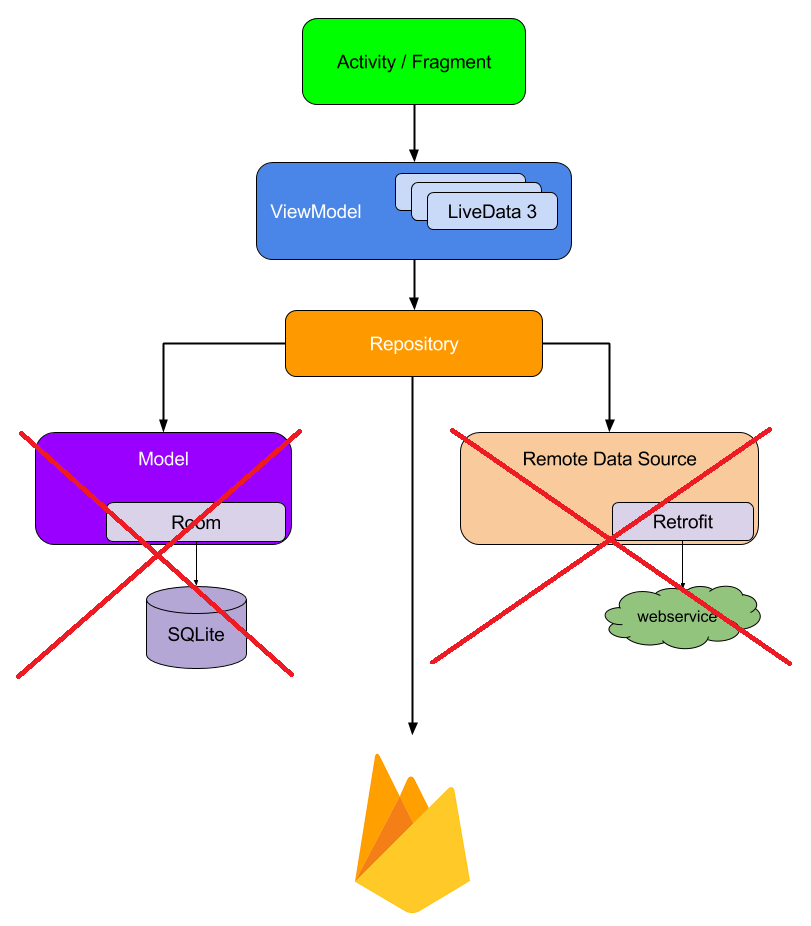

This diagram comes straight out from the Android Architecture Components, except the fact that we’ll not be using Room for local persistence, since Firestore already has its own caching mechanism, nor or a web service as a remote data source, we’ll be simply using Firebase.
As you can see, we have ViewModels and a LiveData and we need to make them work together using the Repository. This solution is very efficient, and it’s actually recommended by the Android team.
 

### Code Organization

The code is divided into seven main parts:

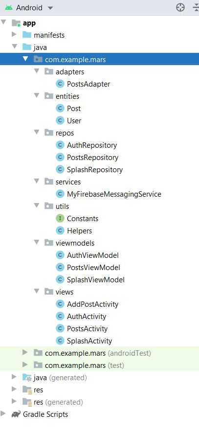

**1. Adapters:** responsible for binding the LiveData to the recycler view items.

**2. Entities:** defines the structure of the objects used within the system.

**3. Repositories:** holds the LiveData and responsible for the connection with the cloud firestore.

**4. Services:** represents the services used inside the system as the push notifications service.

**5. Utils:** contains all the utilities needed by the app, such as all the constant values and all the helper functions used in the app.

**6. ViewModels:** exposes the data to the Views and maintain some state for the View.

**7. Views:** the attached part with the XML files, which is aware of the activity lifecycle and takes actions based on it. It also communicates with and triggers the ViewModels in order to get the needed data.
 

### Third Parties

1. Firebase Authentication Service
   - Google Login.
   - Facebook Login.
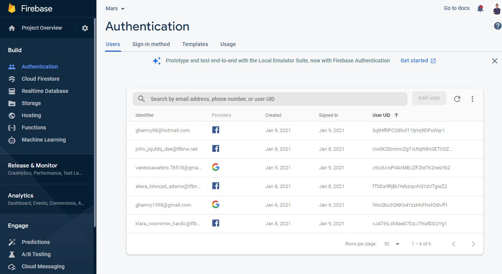
 

2. Firebase Cloud Firestore (Database)
   - Table for users.
   - Table for posts.
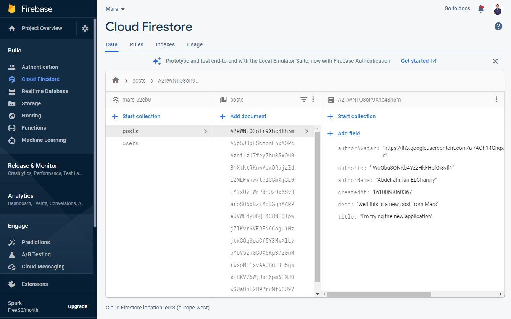
 

3. Firebase Cloud Messaging (FCM)
    - Send to all users (Broadcast).
    - Send on a certain topic (Initially all users are subscribed to “posts” topic).
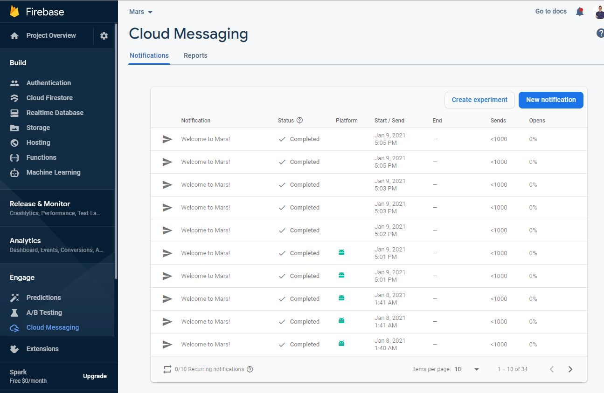
 

4. Facebook Developers Console
We’ve got 3 test users:
   - mars_hxbmpvv_user@tfbnw.net
   - alexa_lstwxpd_adams@tfbnw.net
   - klara_rwsmrmw_kardic@tfbnw.net
  
All have the same password which is “Vorx!123”.

*(Kindly be noted that the app is in-development mode, so we can only use Facebook authentication through the registered devices on console).*

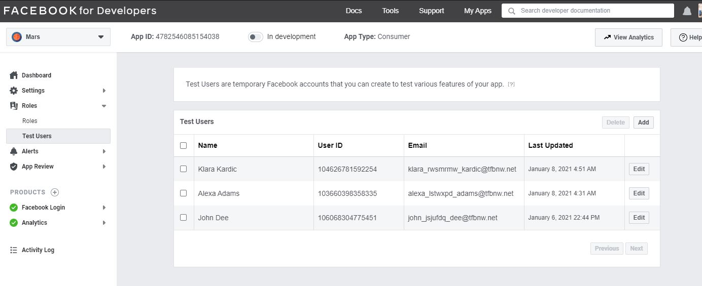
 

## App Flow and Corner Cases

### Authentication Scenario

- The app starts by checking if this user is authenticated or not.
- If the user is authenticated, the app automatically navigates to the Posts Activity, otherwise, the app navigates to the Authentication Activity, and then user authenticates using any of the available authentication options.

*Google Login*
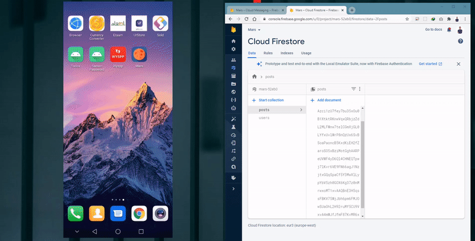

*Facebook Login*
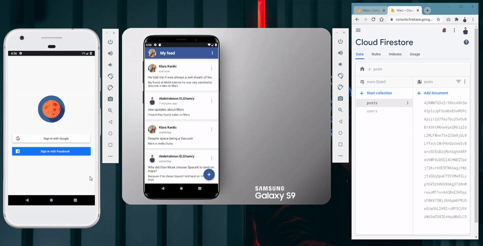

### View Feeds Scenario

- The app requests all the existing feeds from the cloud firestore.
- If there’s available data, the Posts Activity will show cards containing the posts, otherwise, it will display empty feed.

*View feeds and listen to posts*
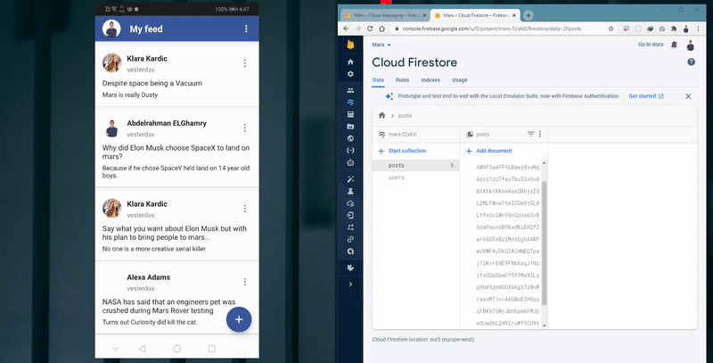

*Adding post with Speech-To-Text*
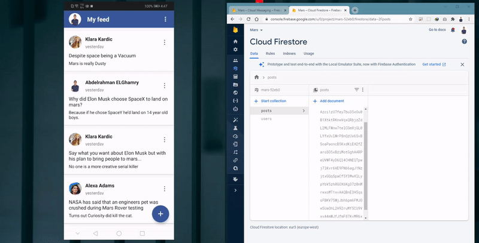

*Refresh feeds*
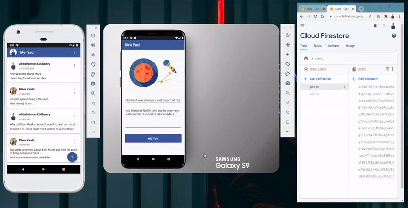

*FCM Notification*
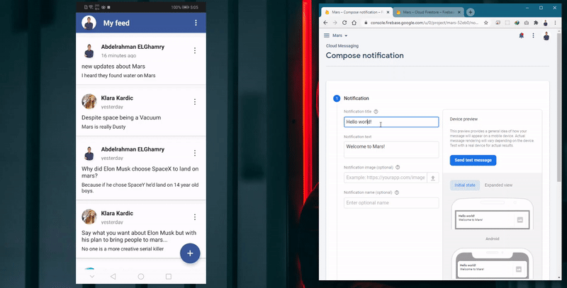
 

### Corner Cases

The user navigates to the Add Post Activity and tries to add:

- An empty post.
- Post with no title.
- Post with no description.
- Post with either the title or description is white-spaces.
  
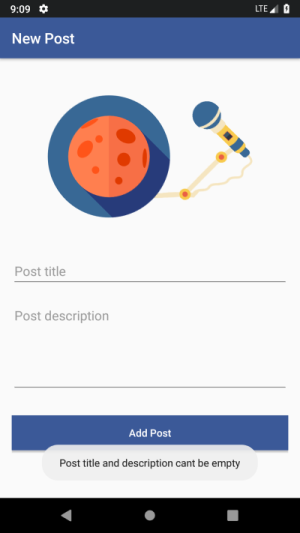

The app doesn’t add the post and displays a toast message to the user that clarifies the problem.

## Links

[Application (APK)](https://drive.google.com/file/d/1oJ8FxLYamsLE7NGybfx--n7cS57CZ3US/view?usp=sharing)

[Demo Video (MP4)](https://drive.google.com/file/d/1E7sKpc2sgPFysSbdE3pLJRoO4thzkyv2/view?usp=sharing)
